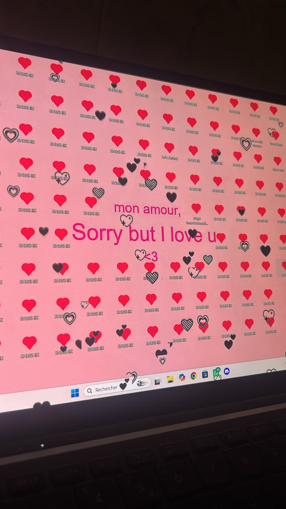
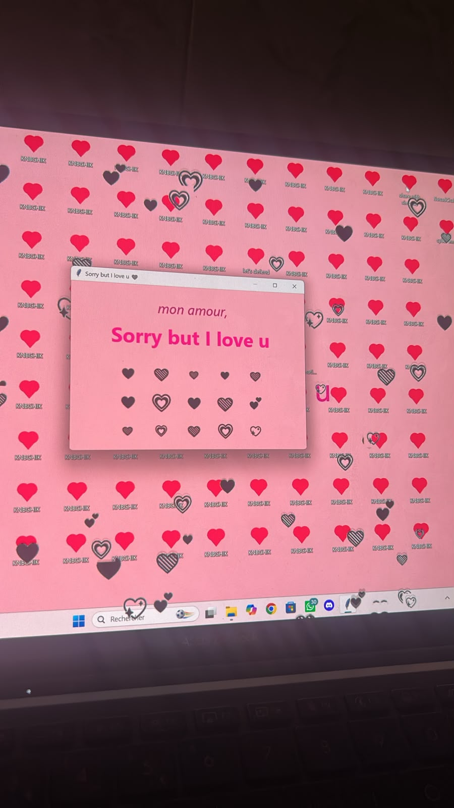

# 💘 CupidStrike — Consensual, Fully-Reversible Desktop-Hijack Payload

> *Une charge « offensive » qui détourne tout le bureau… puis restaure absolument tout,
> toute seule. L'esthétique d'un malware, l'éthique d'un cadeau.*

**CupidStrike** est une preuve de concept (proof-of-concept) inoffensive pour **Windows**,
dans l'esprit d'une charge red-team — mais **visible, consentie et 100 % réversible**.
Quand on la lance, elle **détourne tout le bureau** pendant quelques minutes : pluie de
cœurs plein écran, fond d'écran, icônes de dossiers et titres de fenêtres remplacés par le
message *« Sorry but I love u »*… puis elle **remet absolument tout comme avant, sans
laisser aucune trace**.

C'est une démonstration ludique de techniques d'« environment tampering » Windows
(fond d'écran via `SystemParametersInfoW`, icônes via `desktop.ini`, overlay `tkinter`,
titres via `EnumWindows`) — le tout avec sauvegarde/restauration systématique de l'état
d'origine. Autrement dit : le *look* d'un malware, mais rien de malveillant.

C'est une surprise romantique et inoffensive : à lancer sur son propre PC, ou à montrer
à quelqu'un qui est d'accord de cliquer « Oui ». Rien n'est installé, rien n'est caché,
et tout est réversible.

> ⚠️ **Blague consentie et réversible.** Le programme affiche une fenêtre de
> confirmation avant de démarrer et restaure tout à la fin. Il n'est **pas** conçu
> pour être exécuté à l'insu de quelqu'un, ni caché, ni rendu indétectable.

---

## 📸 Aperçu

Le bureau pendant l'effet — fond rose, message d'amour, dossiers en cœur, et la popup :

| Le bureau envahi de cœurs | La popup au centre de l'écran |
|:---:|:---:|
|  |  |

---

## ✨ Ce que ça fait

Pendant la durée choisie (10 minutes par défaut), en même temps :

- 🌧️❤️ Une **pluie de cœurs animés** qui tombent en surimpression sur tout l'écran.
- 💬 Une **popup rose** avec un message personnalisable (prénom + « Sorry but I love u »).
- 🖼️ Le **fond d'écran** devient rose avec le message au centre.
- 🪟 Le **titre de toutes les fenêtres** ouvertes affiche le message.
- 📁 Les **icônes des dossiers** du bureau deviennent des cœurs.
- 🗂️ Le bureau se **remplit de dossiers** au nom personnalisable (« KNBGHIK »), tous en icône cœur.
- 🎵 Une **petite mélodie** au lancement et à la fin (via `winsound`, intégré à Windows).

À la fin du minuteur : **tout est restauré** (fond d'écran, icônes, titres) et les
dossiers créés sont supprimés automatiquement.

## 🔒 Sûreté / réversibilité

- Une **confirmation** est demandée avant de lancer quoi que ce soit.
- **Aucun droit administrateur** requis, rien d'installé en permanence.
- L'état d'origine (fond d'écran, `desktop.ini` des dossiers) est **sauvegardé** avant
  modification, dans `%TEMP%`, puis restauré.
- Les dossiers créés ne sont supprimés que **s'ils sont vides** (aucun risque de perte
  de données) et uniquement ceux listés dans le fichier de suivi.
- **Filet de secours** si le PC s'éteint en plein effet — rouvrir PowerShell dans le
  dossier et lancer :

  ```powershell
  python love_mode.py --restore
  ```

## 🚀 Utilisation

### Prérequis
- Windows
- Python 3.x
- [Pillow](https://pypi.org/project/pillow/) : `pip install pillow`
  (le launcher l'installe tout seul au besoin)

### Lancer
```powershell
python love_mode.py
```
Ou double-clic sur **`Lancez-moi.bat`**.

Une fenêtre demande confirmation : cliquez **« Oui »** pour lancer, **« Non »** pour annuler.

### 🧪 Tester sans Python (exe prêt à l'emploi)

Un exécutable Windows est fourni dans **[`dist/love_mode.exe`](dist/love_mode.exe)** :
téléchargez-le et double-cliquez dessus, aucune installation de Python requise.

Deux lanceurs sont disponibles selon le rendu souhaité :

| Lanceur | Effet |
|---|---|
| **`Lancez-moi.bat`** | Ouvre une petite fenêtre console + l'effet. |
| **`simo.vbs`** | Lance l'effet **sans la fenêtre console** (plus propre). |

> ℹ️ **À propos de `simo.vbs`** : il ne fait que **masquer la fenêtre console**. La
> fenêtre de confirmation « Oui / Non » s'affiche **toujours** : rien ne démarre sans
> ton accord. Le programme n'est pas rendu furtif, il reste consenti et réversible.

> ⚠️ Un `.exe` non signé déclenche l'alerte SmartScreen (« Windows a protégé votre
> PC ») : c'est normal pour un petit programme sans réputation. Clique sur
> « Informations complémentaires » → « Exécuter quand même », ou lance plutôt le
> script Python si tu préfères.

## ⚙️ Configuration

Tout se règle en haut de [`love_mode.py`](love_mode.py) :

```python
DUREE_SECONDES = 600          # durée de l'effet (600 = 10 minutes)
MESSAGE = "Sorry but I love u"
PRENOM = "mon amour"          # le prénom affiché
NB_DOSSIERS = 100             # nombre de dossiers cœur créés sur le bureau
NOM_AFFICHE = "KNBGHIK"       # nom affiché des dossiers créés
```

## 📂 Contenu du projet

| Fichier | Rôle |
|---|---|
| [`love_mode.py`](love_mode.py) | Le cœur du programme : effets, sauvegarde et restauration. |
| [`launcher.py`](launcher.py) | Vérifie/installe les dépendances puis lance l'effet. |
| [`Lancez-moi.bat`](Lancez-moi.bat) | Double-clic pour lancer sous Windows (avec console). |
| [`simo.vbs`](simo.vbs) | Lance l'effet sans la fenêtre console (confirmation conservée). |
| [`dist/love_mode.exe`](dist/love_mode.exe) | Exécutable prêt à tester, sans installer Python. |
| [`build_exe.py`](build_exe.py) | Construit un `.exe` autonome (optionnel, via PyInstaller). |
| `README.md` / `README.txt` | Documentation. |
| `LICENSE` | Licence MIT. |

## 🛠️ Comment ça marche (technique)

- **Cœurs / popup** : `tkinter` (fenêtres `Toplevel`, couleur transparente pour laisser
  passer les clics, animation via `after()`).
- **Fond d'écran** : image générée avec Pillow, appliquée via
  `SystemParametersInfoW`. L'ancien fond est lu avant, puis restauré.
- **Icônes de dossiers** : un `desktop.ini` (avec `IconResource`) est écrit dans chaque
  dossier, puis `SHChangeNotify` force Explorer à recharger l'icône. L'état d'origine est
  sauvegardé et restauré.
- **Titres de fenêtres** : `EnumWindows` + `SetWindowTextW`.
- **Mélodie** : `winsound.Beep` dans un thread.

## 📦 Construire un exécutable (optionnel)

```powershell
python build_exe.py
```
Produit `dist/love_mode.exe`.

> ℹ️ Un `.exe` PyInstaller **non signé** déclenche souvent SmartScreen (« Windows a
> protégé votre PC ») et parfois des antivirus : c'est un **faux positif** classique de
> PyInstaller. Le binaire n'est volontairement **pas** distribué dans ce repo — compile-le
> toi-même si tu en veux un.

## ⚖️ Éthique & avertissement

Ce projet est une **blague inoffensive** : visible, consentie, temporaire, entièrement
réversible. À utiliser sur ta propre machine ou avec l'accord de la personne.

**À ne pas faire** : l'exécuter sur la machine de quelqu'un sans son accord, le cacher, le
rendre persistant ou tenter d'échapper aux antivirus. Ce serait détourner un jouet en
logiciel malveillant. L'auteur décline toute responsabilité en cas d'usage abusif.

## 📄 Licence

MIT — voir [LICENSE](LICENSE).
